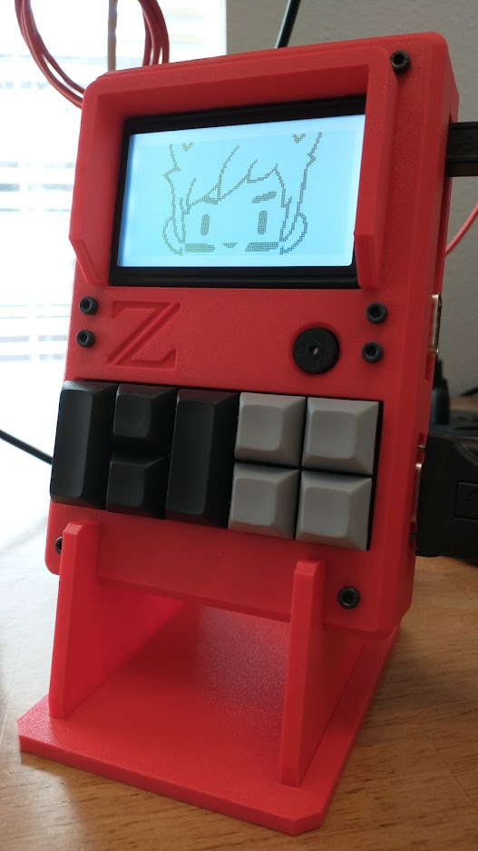

### Description
Z-FIGHTER is a minimal chip-count Z80 hobby computer loosely based on [Grant Searle's CP/M on breadboard](http://searle.x10host.com/cpm/index.html "Grant Searle's CP/M on breadboard") project. As a fully assembled unit in its custom 3D-printed enclosure, Z-FIGHTER has a handheld-style form factor with front panel accessories intended for user-created software and games. Connected via serial to a computer or terminal, Z-FIGHTER can be used to enjoy a full CP/M 2.2 environment or Microsoft BASIC in ROM. Finally, a parallel port and some external CPU control pins are provided to the user for hardware hacking and expansion.

### Specifications
- Z80 CPU @ 7.3728MHz
- CompactFlash interface for CP/M 2.2 operating system and file storage
- Z80 SIO/0 with dual 115200 bps RS-232 ports
- Jumper-selectable optional clock oscillator (X2) for SIO/0 port B (e.g.  614.4 KHz/64 for 9600 bps)
- Jumper-selectable RS-232 CTS flow control
- i8255 PPI-based parallel port reserved for accessory daughterboard
- i8255 PPI-based user parallel port
- 512K ROM with external DIP-3 switches for manual ROM paging and ATF22V10C SPLD for memory map customization
- USB type-B power connector
- DS1233 supervisory circuit
- Optional jumpers to supply +5V to pin 9 on RS-232 ports (non-standard, for use at user's own risk)
- External CPU control header offering access to /INT, /NMI and clock signals 

### Accessory board specifications
- 8x Cherry MX key switches
- ST7920 128x64 LCD module with software-controllable backlight
- Electromagnetic buzzer (CPU-controlled)

### To-do
- Assembly instructions